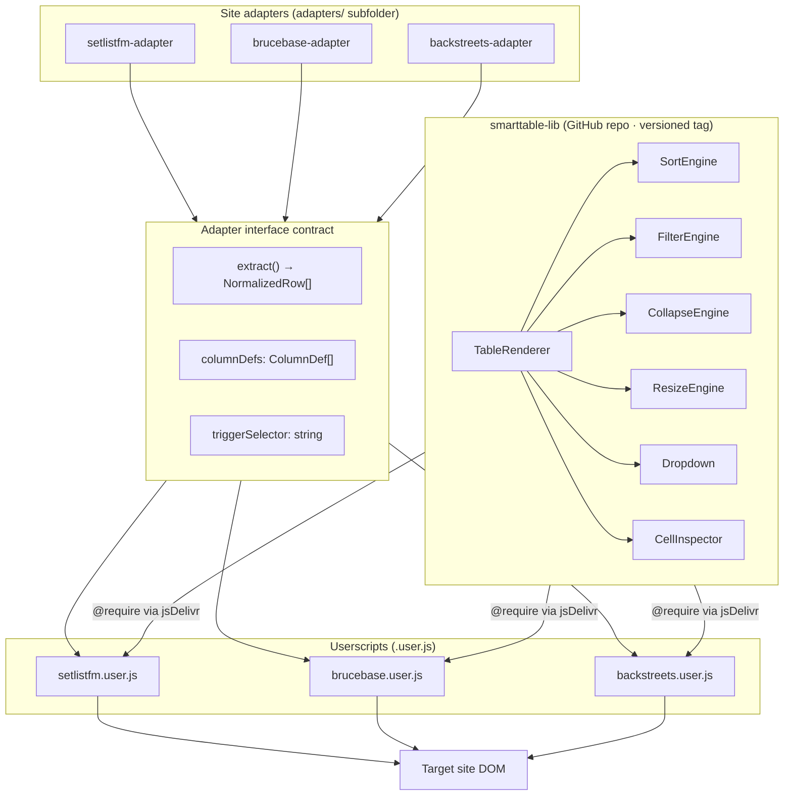
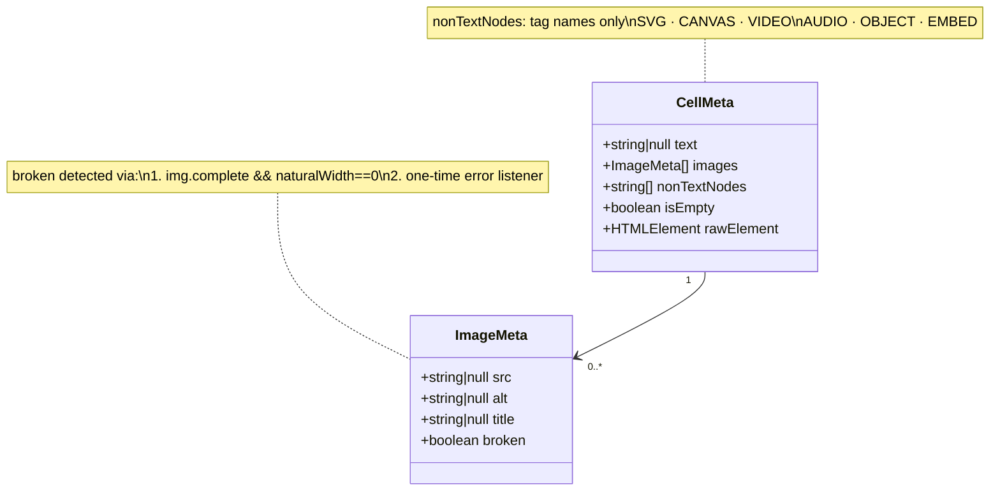
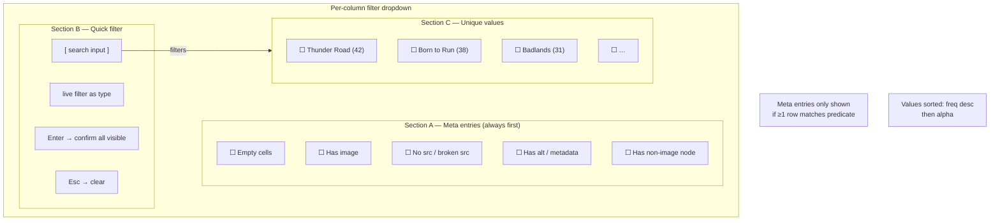
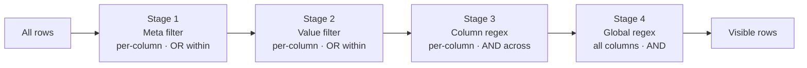
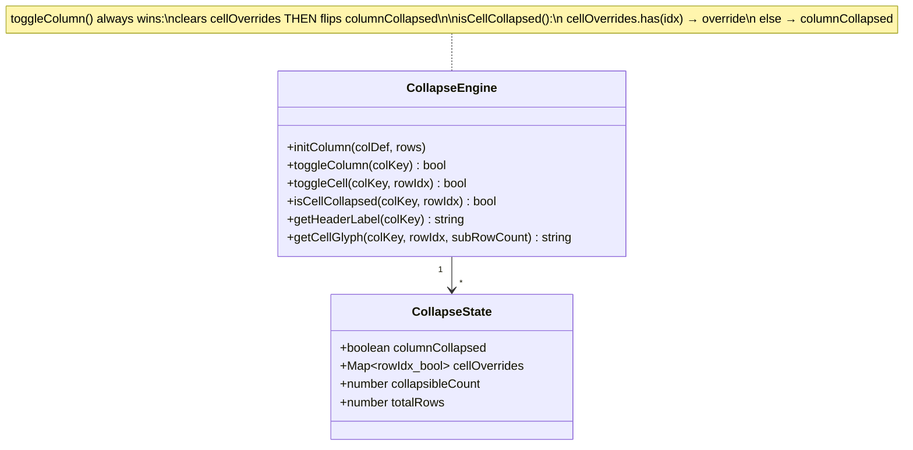
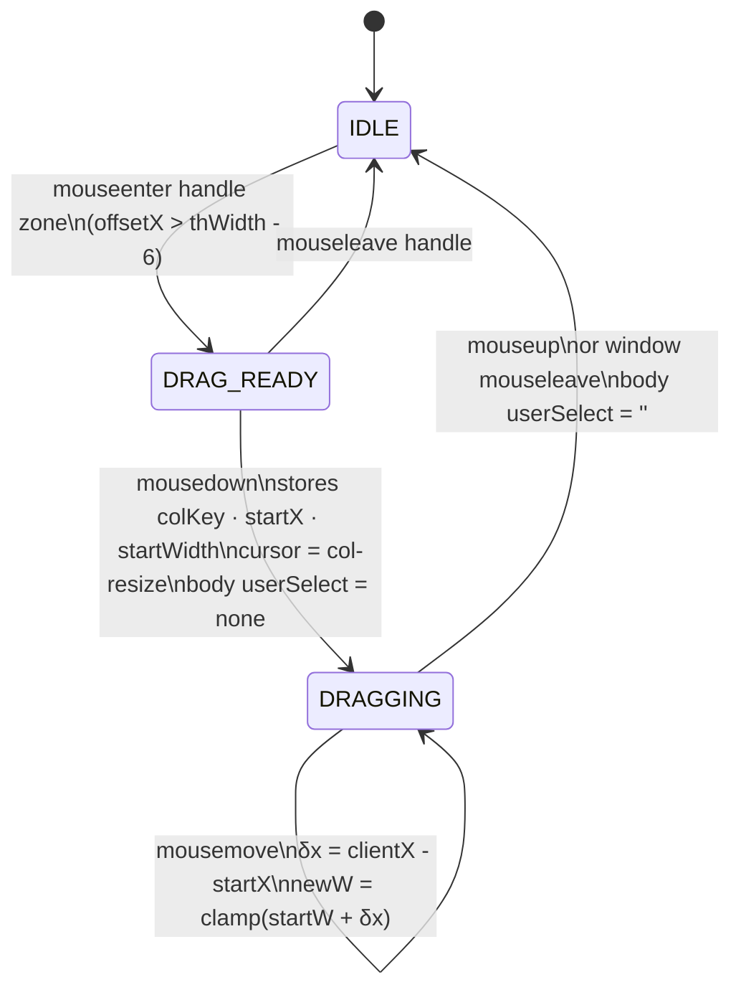
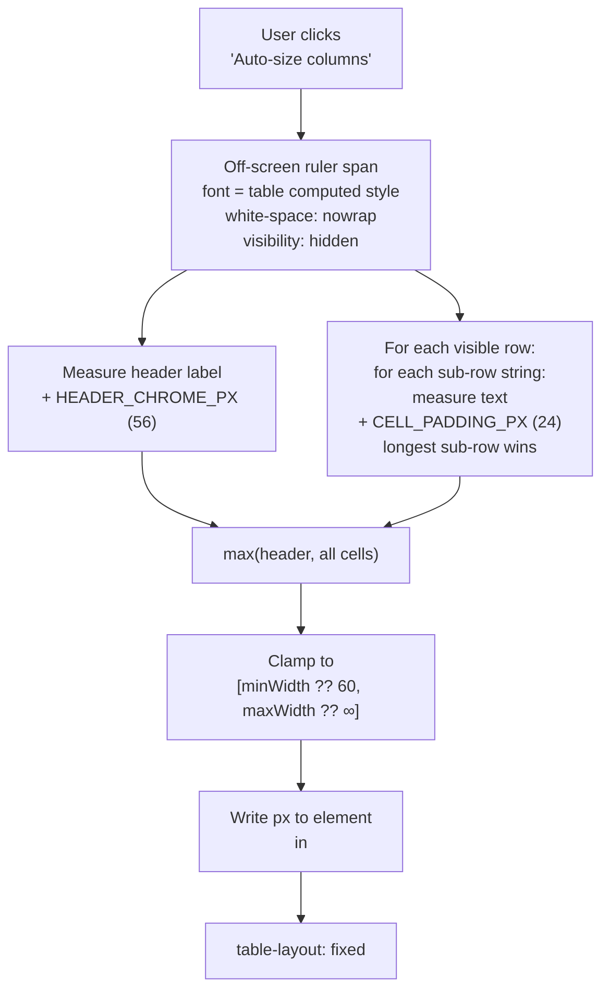
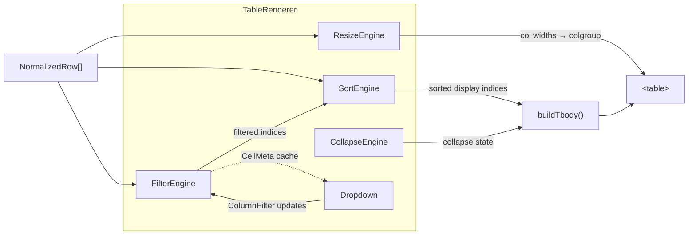

# Architecture Diagrams

All diagrams are in Mermaid syntax, readable by Claude Code and renderable
in GitHub, VS Code (with Mermaid extension), and most markdown previewers.

---

## Diagram 1 — Three-layer project architecture



---

## Diagram 2 — CellMeta object model



---

## Diagram 3 — Column filter dropdown sections



---

## Diagram 4 — Filter pipeline



**Combining rules:**
- Meta selections within one column: OR
- Value selections within one column: OR
- All column filters across columns: AND
- Global regex: AND with everything

---

## Diagram 5 — CollapseState and resolution



---

## Diagram 6 — Column header anatomy

```
┌─────────────────────────────────────────────────────┐
│  Song title        1▲    ▲ 3/120      ⧩             │
│  │                 │ │   │            │              │
│  column label      │ │   collapse     filter button  │
│                    │ │   badge        (⧩ = active)   │
│               sort │ sort                            │
│             priority direction                       │
└─────────────────────────────────────────────────────┘
                                        ◄──6px──►
                                        drag handle zone
```

---

## Diagram 7 — Data cell anatomy (collapsed vs expanded)

```
COLLAPSED:
┌─────────────────────────────┐
│ ▲ +4  Thunder Road          │
│ │  │  │                     │
│ │  │  peek row (sub-row 0)  │
│ │  └─ hidden count          │
│ └──── toggle (click=expand) │
└─────────────────────────────┘

EXPANDED:
┌─────────────────────────────┐
│ ▼ -4  Thunder Road          │
│        Born to Run          │
│        Badlands             │
│        The Promised Land    │
│ │  │                        │
│ │  └─ collapse count        │
│ └──── toggle (click=collapse)│
└─────────────────────────────┘

Single-row cell (no toggle, no glyph):
┌─────────────────────────────┐
│  Thunder Road               │
└─────────────────────────────┘
```

**Glyph convention:** arrow points in direction of action (not current state).
`▲ +4` = "4 rows hidden, click to expand upward"

---

## Diagram 8 — Resize drag state machine



---

## Diagram 9 — Auto-resize measurement flow



**Key rule:** auto-resize measures **all sub-rows** even in collapsed cells.
Column width always fits fully expanded content — expanding a cell never
causes a layout shift.

---

## Diagram 10 — Engine wiring inside TableRenderer


